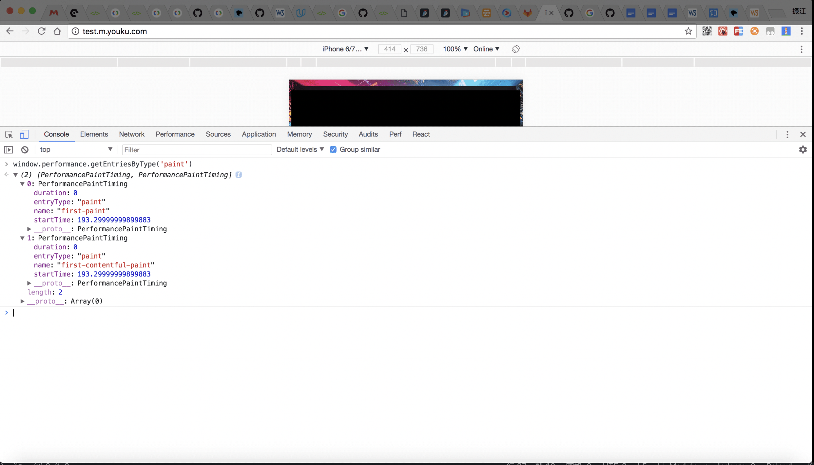
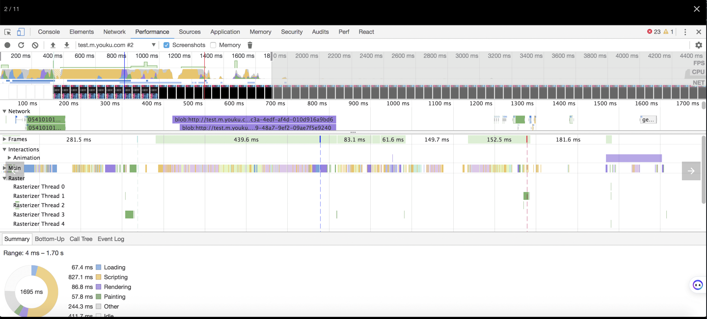
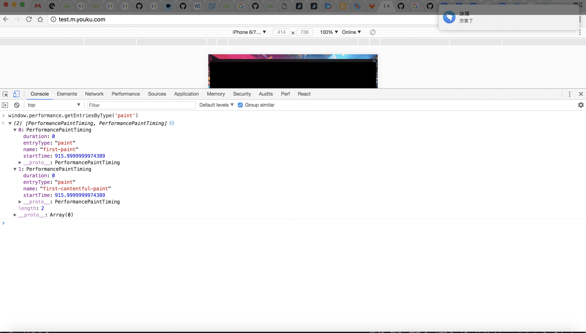
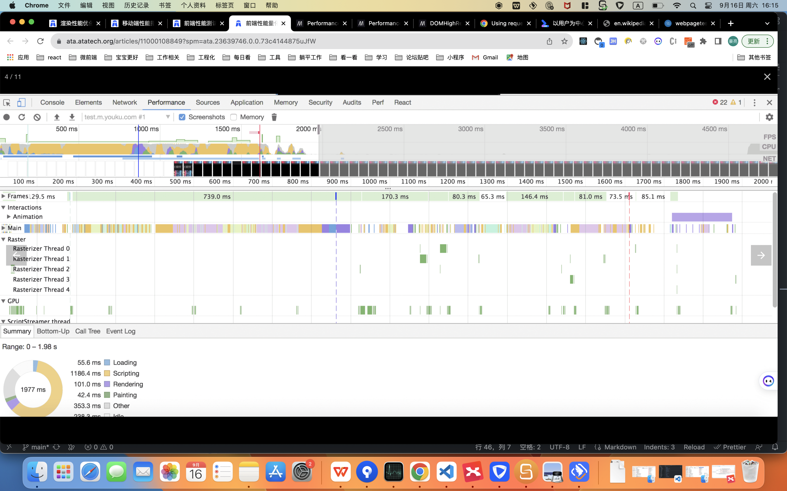
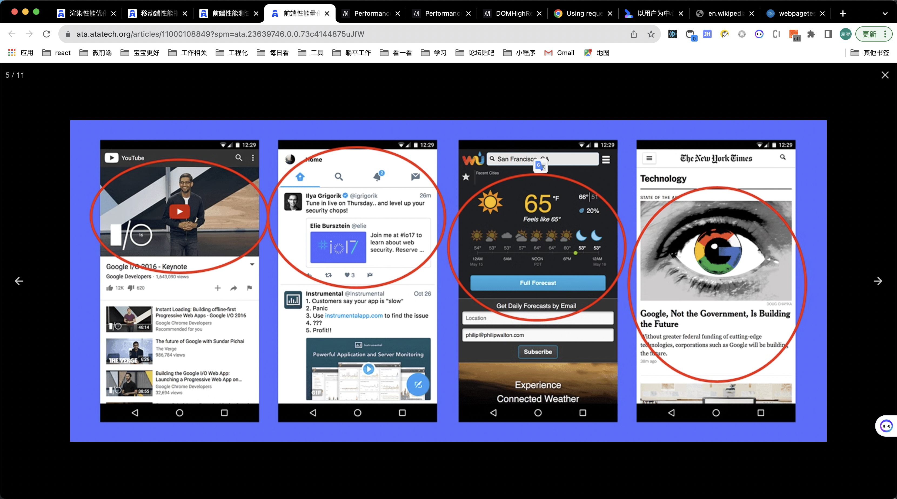
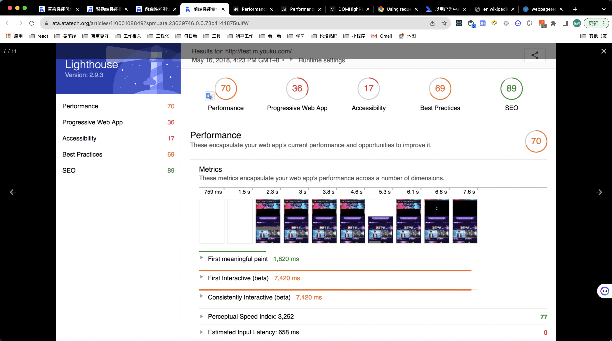
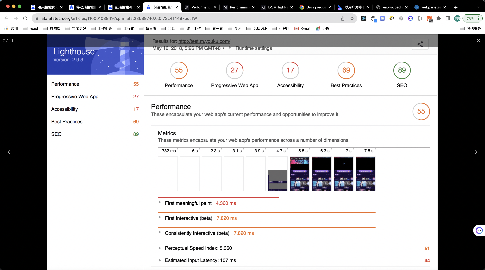
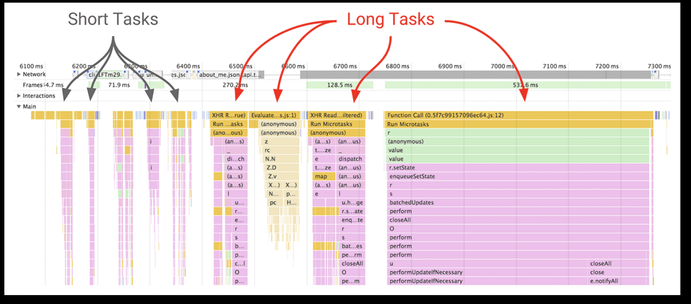

前端性能量化标准

我们经常能看到大量介绍前端如何进行性能优化的文章。然而很多文章只介绍了如何优化性能，却未能给出一个可计算，可采集的性能量化标准。甚至看到一些文章，在介绍自己做了优化后的性能时，提到页面加载速度提升了多少多少，但是当你去问他你怎么测量性能的时，却不能给出一个科学的、通用的方法。
其实，在进行性能优化前，首先需要确定性能衡量标准。前端性能大致分为两块，页面加载性能和页面渲染性能。页面加载性能指的是我们通常所说的首屏加载性能。页面渲染性能指的是用户在操作页面时页面是否能流畅运行。滚动应与手指的滑动一样快，并且动画和交互应如丝般顺滑。这两种页面性能，都需要有可量化的衡量标准。
本文参考了谷歌提出的性能衡量方式。首先确定以用户体验为中心的性能衡量标准。然后，针对这些性能标准，制定采集性能数据的方法，以及性能数据分析方法。最后，结合性能量化标准，提出优化性能的方法。

页面加载性能

  工具：Lighthouse
  以用户为中心的性能度量：https://developers.google.com/web/fundamentals/performance/user-centric-performance-metrics

性能度量标准

  下表是与页面加载性能相关的用户体验。

    用户体验	描述
    它在发生吗？	网页浏览顺利开始了吗？服务端有响应吗？
    它是否有用？	用户是否能看到足够的内容？
    它是否可用？	用户是否可以和页面交互，还是页面仍在忙于加载？
    它是否令人愉快的？	交互是否流程和自然，没有卡段或闪烁？

 与用户体验相关，制定以下度量标准：
  First paint and first contentful paint (它在发生吗？)
    FP 和 FCP 分别是页面首次绘制和首次内容绘制。首次绘制包括了任何用户自定义的背景绘制，它是首先将像素绘制到屏幕的时刻。首次内容绘制是浏览器将第一个 DOM 渲染到屏幕的时间。该指标报告了浏览器首次呈现任何文本、图像、画布或者 SVG 的时间。这两个指标其实指示了我们通常所说的白屏时间。
    参考 api: https://w3c.github.io/paint-timing/
    在控制台查看 paint 性能：

      window.performance.getEntriesByType('paint')
      在代码中查看 paint 性能：
      const observer = new PerformanceObserver((list) => {
        for (const entry of list.getEntries()) {
          // `entry` is a PerformanceEntry instance.
          console.log(entry.entryType);
          console.log(entry.startTime);
          console.log(entry.duration);
        }
      });

      // register observer for long task notifications
      observer.observe({entryTypes: ["paint"]});
      ssr:
       
        
      csr:
      
      

  First meaningful paint and hero element timing（它是否有用？）
  FMP(首次有意义绘制) 是回答“它是否有用？”的度量标准。因为很难有一个通用标准来指示所有的页面当前时刻的渲染达是否到了有用的程度，所以当前并没有制定标准。对于开发者，我们可以根据自己的页面来确定那一部分是最重要的，然后度量这部分渲染出的时间作为FMP。
  

  chrome 提供的性能分析工具 Lighthouse 可以测量出页面的 FMP，在查阅了一些资料后，发现 Lighthouse 使用的算法是：页面绘制布局变化最大的那次绘制（根据 页面高度/屏幕高度 调节权重）

  First meaningful paint = Paint that follows biggest layout change
  layout significance = number of layout objects added / max(1, page height / screen height)
  参考：Time to First Meaningful Paint: a layout-based approach
  ssr: 
  csr: 

  Long tasks（它是否令人愉快的？）

  我们知道，js 是单线程的，js 用事件循环的方式来处理各个事件。当用户有输入时，触发相应的事件，浏览器将相应的任务放入事件循环队列中。js 单线程逐个处理事件循环队列中的任务。
  如果有一个任务需要消耗特别长的时间，那么队列中的其他任务将被阻塞。同时，js 线程和 ui 渲染线程是互斥的，也就是说，如果 js 在执行，那么 ui 渲染就被阻塞了。此时，用户在使用时将会感受到卡顿和闪烁，这是当前 web 页面不好的用户体验的主要来源。
  Lonag tasks API 认为一个任务如果超过了 50ms 那么可能是有问题的，它会将这些任务展示给应用开发者。选择 50ms 是因为这样才能满足RAIL 模型 中用户响应要在 100ms 内的要求。
  

  const observer = new PerformanceObserver((list) => {
  for (const entry of list.getEntries()) {
      // `entry` is a PerformanceEntry instance.
      console.log(entry.entryType);
      console.log(entry.startTime); // DOMHighResTimeStamp
      console.log(entry.duration); // DOMHighResTimeStamp
    }
  });

  // register observer for long task notifications
  observer.observe({entryTypes: ['longtask']});

  Time to interactive（它是否可用？）
  TTI(可交互时间) 指的是应用既在视觉上都已渲染出了，又可以响应用户的输入了。应用不能响应用户输入的原因主要包括：

  使得页面上的组件能工作的 js 还未加载
  长任务阻塞了主线程
  TTI 指明了页面的 js 脚本都被加载完成且主线程处于空闲状态了的时间。

  // detect long tasks hack
  (function detectLongFrame() {
    var lastFrameTime = Date.now();
    requestAnimationFrame(function() {
      var currentFrameTime = Date.now();

      if (currentFrameTime - lastFrameTime > 50) {
        // Report long frame here...
      }

      detectLongFrame(currentFrameTime);
    });
  }());

  hack 方式存在一些副作用：

  给每一帧渲染添加额外负担
  它防止了空闲块
  非常影响电池寿命
  性能测量的代码最重要的准则是它不该使性能变差。